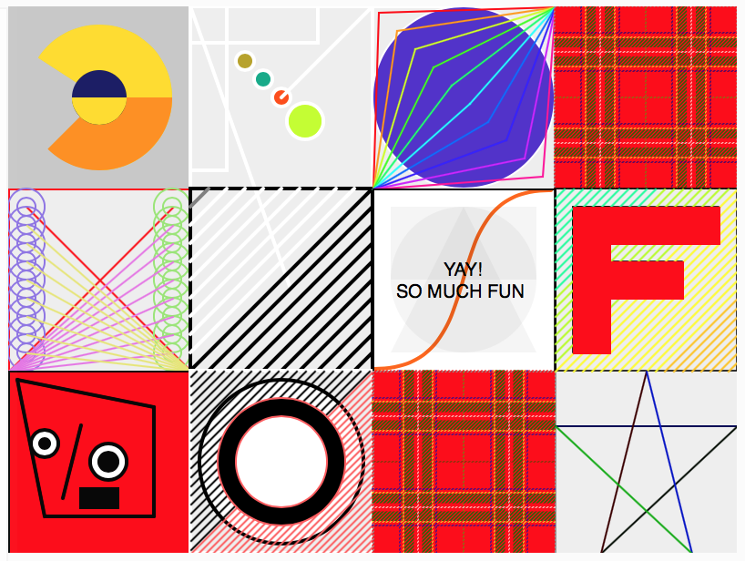
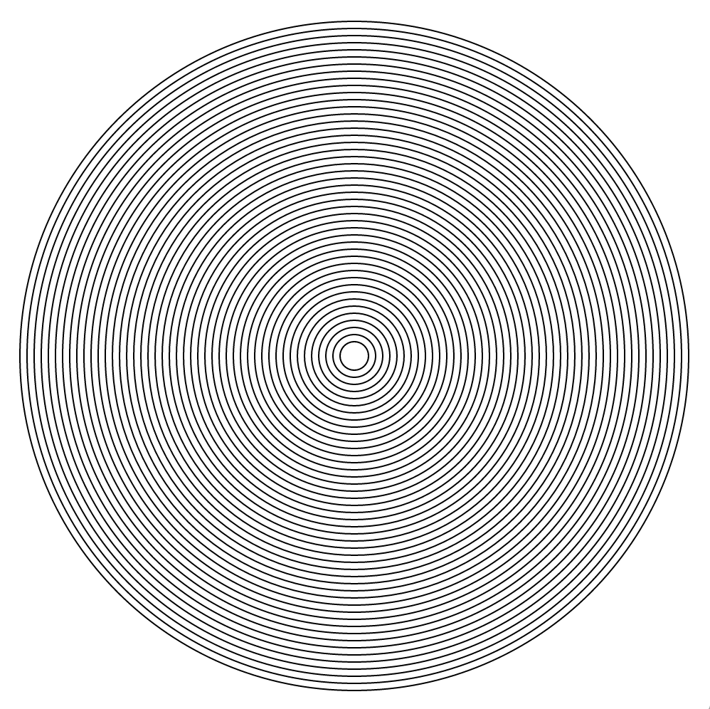
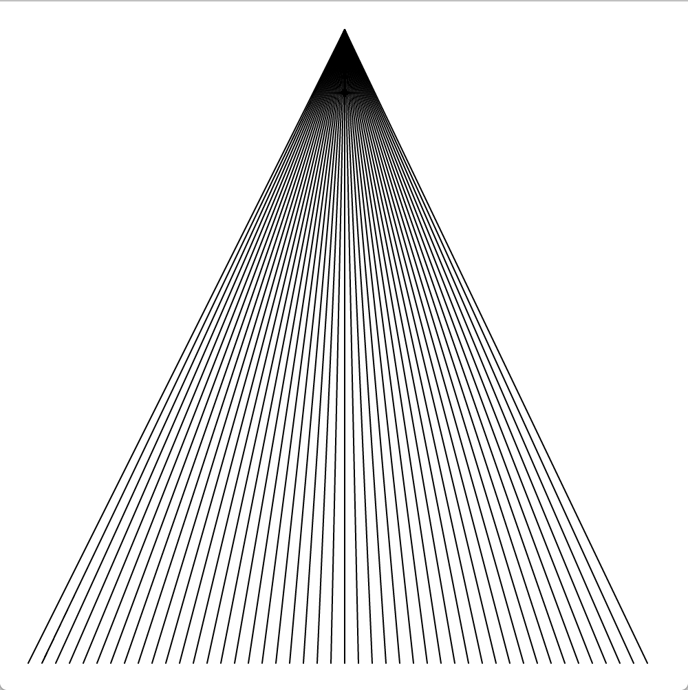
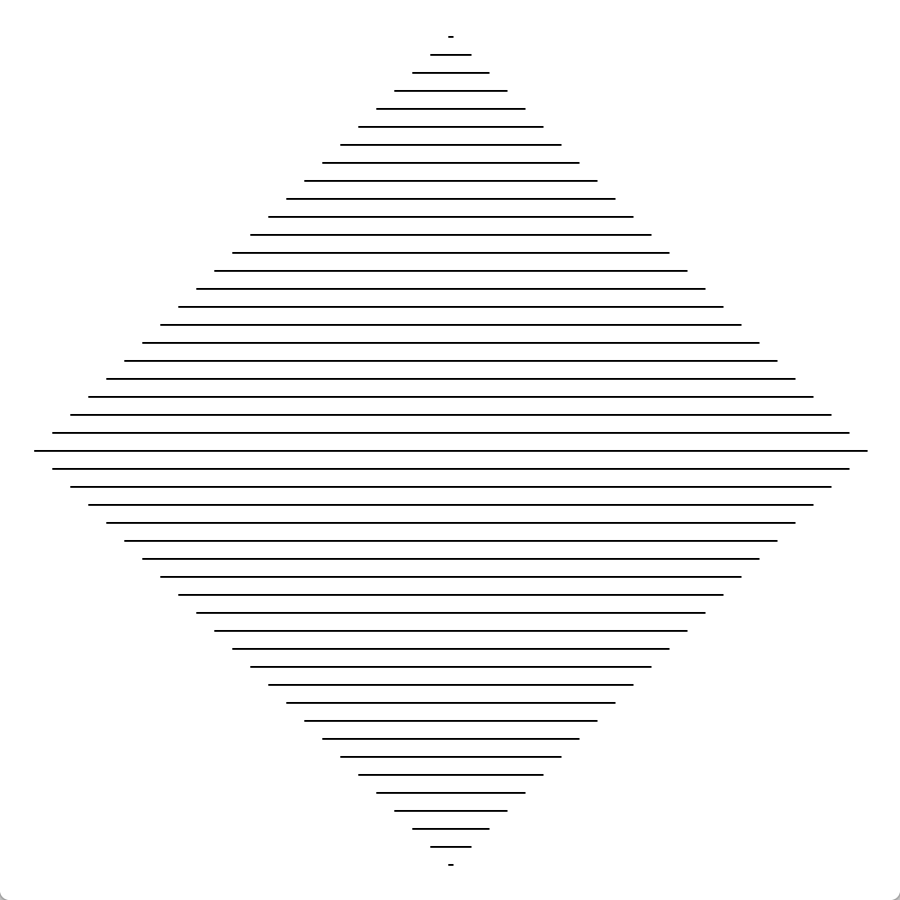
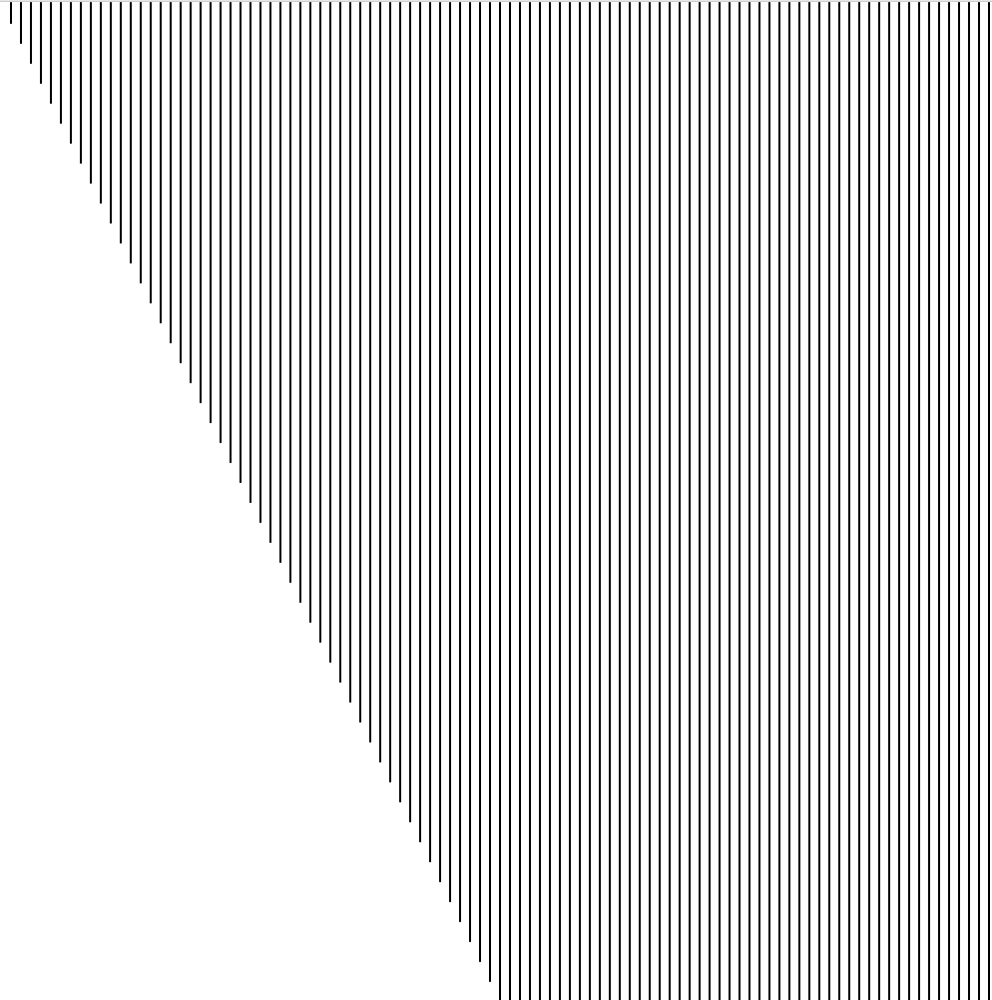
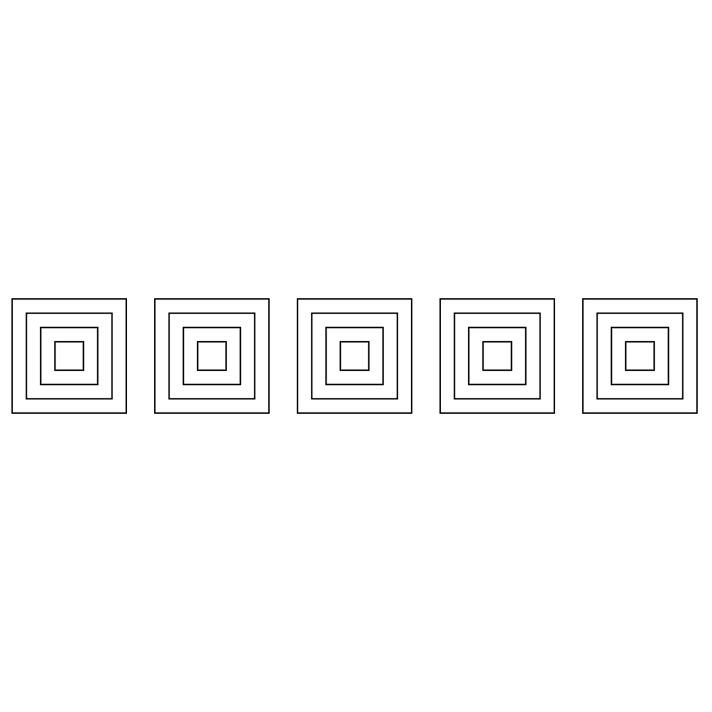

# CCA Programming & Electronics, Fall 2017

This course repository contains homework assignments, useful guides, and code for "Programming & Electronics" at CCA, Fall 2017.

Also included in this repository is the official [course syllabus](syllabus.pdf).

### Week 1: Wednesday, September 6, 2017

Lecture:
- Introductions
- What is programming?
- Goals & course details

Hands-on activities:
- Human Embodiment of Programmer & Robot
  - Programs generally run line-by-line.
  - Repetition, decision making, and recipes break that up.
- [Solving Puzzles](puzzle-sheets.pdf)

#### Building Blocks of Code

In class, we discussed the four basic building blocks of code: actions & recipes, remembering, making decisions, and repetition. 

[Here are some notes.](building-blocks-programs.md)

#### Inspiration

Finally, here are some inspirational videos to get you excited for our class if you're not already:
- Creative Code
  - [Interviews with Practitioners](http://www.youtube.com/watch?v=eBV14-3LT-g)
- Basic robots
  - [Coffee-can robot](http://www.youtube.com/watch?v=b0mIshBIbvI#t=24)
  - [Tree-climbing robot](http://www.youtube.com/watch?v=zkpH1BjD6Wc)
  - [Self-balancing robot](http://www.youtube.com/watch?v=Tw9Jr-SPL0Y)
  - [Insect robot](http://www.youtube.com/watch?v=tOsNXg2vAd4#t=120)
  - [Treadbot](http://www.youtube.com/watch?v=YblSltHDbIU)
  - [Velociraptor robot](http://www.youtube.com/watch?v=lPEg83vF_Tw)
- Installations
  - [The Bay Lights](http://thebaylights.org/)
  - [Murmur Wall](http://www.future-cities-lab.net/projects/#/murmurwall/)
  - [Floating Couch](http://vimeo.com/72826106)
  - [Wooden Segment Mirror](https://www.youtube.com/watch?v=BZysu9QcceM#t=36)
  - [Generative design](https://www.youtube.com/watch?v=pNkz8wEJljc)
- Art & Music bots
  - [Textile weaving](https://vimeo.com/71044541)
  - [ReacTable](https://www.youtube.com/user/marcosalonso)
  - [Projection mapping](https://www.youtube.com/watch?v=czuhNcNU6qU)
  - [Laser harp](http://www.youtube.com/watch?v=sLVXmsbVwUs#t=20)
  - [Cubli: Floating Cube](https://www.youtube.com/watch?v=n_6p-1J551Y)
  - [Arc-o-matic](http://vimeo.com/57082262#at=130)
  - [Robo Faber](http://vimeo.com/78771257)
  - [Eggbot](https://www.youtube.com/watch?v=w4cdbV2oaEc)
- Drink-makers
  - [Textspresso](http://www.youtube.com/watch?v=kx9D74t7GD8#t=89)
  - [The Inebriator](http://www.youtube.com/watch?v=WqY7fchs7H0)
- Computer Numerical Control (CNC)
  - [Shapoko / tinyg](http://www.youtube.com/watch?v=pCC1GXnYfFI#t=11)
  - [Makerbot Replicator](http://www.youtube.com/watch?v=NAbiAzYhTOQ)
- Vacuuming
  - [Roomba](https://www.youtube.com/watch?v=0DNkbZvVYvc)

[Homework for Week 1](hw/week1.md)

### Week 2: Wednesday, September 13, 2017

In-class:
- Homework review.
- Translating "pseudo-code" into real code with [Rudy](http://rudy.zamfi.net); here are some notes on the [building blocks of code](building-blocks-code.md).

[Homework for Week 2](hw/week2.md)

### Week 3: Wednesday, September 20, 2017

First, homework review. Then, a workshop.

#### Workshop

Together, we'll experiment with a few sketches to practice variables & functions:

- [A Single Ellipse](http://p5js.zamfi.net/jd/sketches/SkPx0nSPx)
  - Working with a partner, modify this sketch to create an ellipse that extends past the edges of the canvas.
- [Random Dots](http://p5js.zamfi.net/full/HJ6LyTBPx)
  - Working with a partner, modify this sketch to give each ellipse:
     1. A random size.
     2. A random color. (Use HSB for nicer colors!)
  - Here's some code that accomplishes this: [random-dots.js](class-code/random-circles.js)
- [Color and HSB](http://p5js.zamfi.net/full/ByanCnHPx)
  - Working with a partner, modify this sketch so that it continuously changes color instead of stopping at red.
  - Here's the code we created together in class: [cycling-hue.js](class-code/cycling-hue.js)
-   Class Quilt!

    Working with a partner, make two patches for the class quilt! Start with the following code:

    ```javascript
    function yourPatch(x, y) {
      noFill();
      stroke(238);
      rect(x, y, 100, 100);
      
      // your code here!
    }
    
    background(255);
    
    yourPatch((width-100)/2, (height-100)/2);
    ```
    
    Modify the `yourPatch` function, replacing `// your code here!` with drawing commands that draw inside the 100-by-100 pixel square. Use `x` and `y` to get yourself started -- all your shapes should appear within the rectangle bounded to the left by `x`, above by `y`, to the right by `x+100` and below by `y+100`. 
    
    We'll then take all our functions and pattern them together into a class quilt! Making your functions depend on `x` and `y` means that we can place them anywhere in the quilt by "passing in" the appropriate `x` and `y` coordinates for that place in the quilt.
    
    When you like what you have, change the call your `yourPatch` to draw your patch at `(0, 0)` and `(100, 100)` -- make sure your drawing moves along with the coorinates.
    
    Feel free (but not compelled) to remove the border rectangle when you like what you have!
    
    Here's a (frankly, pretty complicated) example that I came up with for myself:
    
    ```javascript
    function jdPatch(x, y) {
      noFill();
      stroke(238);
      rect(x, y, 100, 100);
      
      // blocky J
      fill(238);
      noStroke();
      rect(x+20, y+20, 60, 20);
      rect(x+40, y+40, 20, 40);
      rect(x+20, y+60, 40, 20);
      
      // overlay of lines
      stroke(0);
      var lines = 3;
      while (lines < 50) {
        line(x+lines, y, x, y+lines);
        lines = lines + 5;
      }
      stroke(200);
      while (lines < 100) {
        line(x+lines, y, x, y+lines);
        lines = lines + 3;
      }
      stroke(255, 127, 0);
      lines = 0;
      while (lines < 50) {
        line(x+100, y+lines, x+lines, y+100);
        lines = lines + 4;
      }
      stroke(0, 64, 127);
      while (lines < 100) {
        line(x+100, y+lines, x+lines, y+100);
        lines = lines + 4;
      }
    }
    ```
    
    You don't have to understand exactly how the code above works -- but do notice that **every single coordinate** parameter of every shape and line has `x` or `y` in it -- usually something added to `x` or `y` -- and that's so that every shape is drawn **relative to `(x, y)`**. That way, when I run `jdPatch(0,0)` or `jdPatch(100, 100)`, all my shapes are offset by the correct amount.
    
[Homework for Week 3](hw/week3.md)

### Week 4: Wednesday, September 27, 2017

Thanks to everyone who provided a patch for the class quilt!



#### Loops Workshop

Today, we'll practice loops:

1.  Together, we'll make vertical lines:
    
    

2.  Then, with a partner, you'll make horizontal lines:
    
    
    
3.  Try these concentric circles too:
    
    

4.  And this cone:

    
    
5.  Also this diamond:

    
    
6.  What about these taller lines?
    
    
    
7.  For this you'll need a **loop within a loop**:
    
    

8.  Now try this grid of circles; you'll need **nested loops** for this one too!
    
    

9.  **Challenge:** Using a technique called the "exponential moving average", we can create a smooth easing animation like this:
    
    
    
    The technique works by one variable to store intermediate values for another variable. For example, in the sketch above, the *x-* and *y-* coordinates of the circle are stored in variables `x` and `y`, which are **eased** to the target values given by `mouseX` and `mouseY`.
    
    "Exponential moving average" is a fancy way of saying: first, pick a fixed **rate** at which the easing occurs for a variable reaching its target. That rate controls how much impact the target has on the value each frame. For exampe, if the rate is 10%, then the new value each frame is 10% the target value and 90% the old value of the variable. Here's some sample code; the key is in the line `x = target*rate + x*(1-rate);`:
    
    ```javascript    
    var rate = 0.1;
    var x = 0;
    var target = 100;
    
    while (true) {
      ellipse(x, 100, 15, 15);
      x = target*rate + x*(1-rate); // rate is 0.1, or 10% -- (1-rate) is 0.9, or 90%
    }
    ```
    
    Each frame, x gets 10% closer to its target.
    
    Modify this code to create a circle that follows the mouse as in the anigif above.


#### Working with Loops

Here's one way of working with loops, and figuring out how to turn a pattern into code:

1. Write down the coordinates of the shapes you want to create in your loop.
2. Find the pattern for those coordinates
  a. Where does it start?
  b. Where does it end?
  c. How much does it change each time?
3. Use that pattern in a for loop: `for (var i = START; i < END; i = i + CHANGE) { ... }`
  
For example, to create the following sketch:


...start by writing down some endpoints for those lines:

```
(20, 20) -> (20, 20)
(20, 30) -> (30, 20)
(20, 40) -> (40, 20)
(20, 50) -> (50, 20)
(20, 60) -> (60, 20)
(20, 70) -> (70, 20)
(20, 80) -> (80, 20)
.
.
.
(20, 480) -> (480, 20)
```

...from these coordinates, we can find a pattern for each of the four parameters we need to draw a line:

- `startX`: always 20
- `startY`: starts at 20, ends at 480, goes up by 10 each time
- `endX`: starts at 20, ends at 480, goes up by 10 each time
- `endY`: always 20

...from this pattern, we can generate a loop that draws these lines, by creating a variable that starts at `20`, ends at `480`, and goes up by `10` each time. We won't call the variable `x` or `y` beacuse we don't use it exclusively for either coordinate.

```javascript
for (var i = 20; i <= 480; i = i + 10) {
  var startX = 20;
  var startY = i;
  var endX = i;
  var endY = 20;
  line(startX, startY, endX, endY);
}
```

[Homework for Week 4](hw/week4.md)

### Week 5: Wednesday, October 4, 2017

#### Homework Review

Loops! And share your Sol LeWitt pieces.

On nested loops in particular; given the following sketch:


...it's not necessarily obvious how we might craete this grid. One way to think about it is to first write a function that draws a column (vertical line) of circles at a given x coordinate, perhaps this code:

```javascript
function lineOfCircles(x) {
  var y = 20;
  while (y < height) {
    ellipse(x, y, 15, 15);
    y = y + 20;
  }
}
```

...and then we can use that function inside its own for loop to draw a column of circles every 20 pixels. Full sketch:

```javascript
background(0);
fill(255);

function lineOfCircles(x) {
  var y = 20;
  while (y < height) {
    ellipse(x, y, 15, 15);
    y = y + 20;
  }
}

var x = 20;
while (x < width) {
  lineOfCircles(x);
  x = x + 20;
}
```

The `lineOfCircles` function is in fact entirely optional: we could replace the call to `lineOfCircles(x)` with the function contents exactly, and end up with essentially the same code!

```javascript
background(0);
fill(255);

var x = 20;
while (x < width) {
  var y = 20;
  while (y < height) {
    ellipse(x, y, 15, 15);
    y = y + 20;
  }
  x = x + 20;
}
```

#### Objects & Functions Workshop

Objects are collections of properties. They can help to keep related variables together. For example:

```javascript
var circle = {
  x: 100, 
  y: 100,
  vx: 3,
  vy: 4,
  r: 10
};

var circle2 = {
  x: 120, 
  y: 160,
  vx: 3,
  vy: 4,
  r: 10
};


function setup() {
  createCanvas(400, 400);
}

function draw() {
  background(255);
  
  paint(circle);
  paint(circle2);
  
  move(circle);
  move(circle2);
  
  bounce(circle);
  bounce(circle2);
}

function paint(circle) {
  ellipse(circle.x, circle.y, circle.r * 2, circle.r * 2);
}

function move(circle) {
  circle.x += circle.vx; // circle.x = circle.x + circle.vx
  circle.y += circle.vy;
}

function bounce(circle) {
  if (circle.x > width || circle.x < 0) {
    circle.vx = - circle.vx;
  }
  if (circle.y > height || circle.y < 0) {
    circle.vy = - circle.vy;
  }
}

```

This code creates two objects: `circle` and `circle2`. Each of the `paint`, `move`, and `bounce` functions is defined to act on a single obejct; calling `paint(circle)` makes the function act on the first `circle` object, while calling `paint(circle2)` makes the function act on the second `circle2` object.

"Act on" means that the `circle` variable inside the function actually refers to one of the `circle` or `circle2` objects defined at the top of the code. Which one it refers to depends on whether it was called with `circle` or `circle2` as the parameter.

**Exercise 1**: Add a third circle object.

**Exercise 2**: Add a property to each circle that holds a color.

**Exercise 2a**: Use that property in the `paint` function to draw each circle using its color property.

Next, modify the initial locations -- the `x` and `y` properties of `circle` and `circle2` so both circles start at the bottom of the canvas:

```javascript
var circle = {
  x: 100, 
  y: 400,
  vx: 0,
  vy: -4,
  r: 10
};

var circle2 = {
  x: 160, 
  y: 400,
  vx: 0,
  vy: -4,
  r: 10
};
```

**Exercise 3**: Modify the `bounce` function so that, instead of bouncing, the two circles each reset to the bottom of the canvas when they reach the top.

**Exercise 4**: Modify the `move` function so that the circles (now bubbles!) vibrate in the `x` direction each frame.

**Exercise 5**: Add some interactivity -- use the `keyPressed` function to make the up (and down) arrow keys increase (and decrease) the rate at which the bubbles rise.

In class, we extnded the code above using **arrays** (aka **lists**):

```javascript
var circles = [];

function setup() {
  createCanvas(400, 400);

  var count = 0;
  while (count < 100) {
    circles.push({
      x: random(width),
      y: random(height),
      vx: random(-3, 3),
      vy: random(-3, 3),
      r: 10,
      h: random(360)
    });
    count = count + 1;
  }
}

function draw() {
  background(255);
  noStroke();

  circles.forEach(paint);
  circles.forEach(move);
  circles.forEach(bounce);
}

function paint(circle) {
  colorMode(HSB);
  fill(circle.h, 100, 100);
  ellipse(circle.x, circle.y, circle.r * 2, circle.r * 2);
}

function move(circle) {
  circle.x += circle.vx; // circle.x = circle.x + circle.vx
  circle.y += circle.vy;
}

function bounce(circle) {
  if (circle.x > width || circle.x < 0) {
    circle.vx = -circle.vx;
  }
  if (circle.y > height || circle.y < 0) {
    circle.vy = -circle.vy;
  }
}
```

`circles.push` adds a new circle to the list, and `circles.forEach` runs a function for each circle object.

We also made a fancy, "champagne" version of this code in class:

```javascript
var circles = [];

function setup() {
  createCanvas(400, 400);
  var count = 0;
  while (count < 20) {
    circles.push({
      x: random(width),
      y: height,
      vx: 0,
      vy: random(4),
      r: random(4,10),
      h: random(360)
    });
    count = count + 1;
  }
}

function mouseDragged() {
  circles.push({
      x: mouseX,
      y: mouseY,
      vx: 0,
      vy: -random(4),
      r: random(4,10),
      h: random(360)
    });
}

function draw() {
  background(255);
  noStroke();

  circles.forEach(paint);
  circles.forEach(move);
  circles.forEach(bounce);
}

function isClickedOn(circle) {
  if (dist(mouseX, mouseY, circle.x, circle.y) < circle.r) {
    circle.r = 0;
  }
}

function mousePressed() {
  circles.forEach(isClickedOn);
}

function paint(circle) {
  colorMode(HSB);
  fill(circle.h, 100, 100);
  ellipse(circle.x, circle.y, circle.r*2, circle.r*2);
}

function move(circle) {
  circle.x += random(-2, 2); // vibration
  circle.x += circle.vx; // circle.x = circle.x + circle.vx
  circle.y += circle.vy;
}

function bounce(circle) {
  if (circle.x > width || circle.x < 0) {
    circle.vx = - circle.vx;
  }
  if (circle.y > height || circle.y < 0) {
    circle.vy = - circle.vy;
  }
}
```

[Homework for Week 5](hw/week5.md)


### Week 6: Wednesday, October 11, 2017

In class today, we reviewed the homework, focusing on objects and arrays.

Then we discussed how one could develop the classic small-screen game [Snake](https://www.youtube.com/watch?v=DgrwX5Ypn3Q), breaking the game down into **data**, **rendering**, **simulation**, and **events**:

**Data**:
- **x, y for snake head**
- x, y for snake body segments
- **direction**
- **food locations** (random?)
- score
- speed

**Rendering**:
- **background**
- **snake**
- **food**
- score
- boundaries

**Simulation**:
- **snake moves**
- snake grows
- game over?

**Events**:
- **snake head reaches food**
- **user presses arrow key**
- boundary collision

For **data**, your goal is to create a computational representation of what you need for your program. I recommend starting here. Use dummy data to start, just so that you have something to render.

Next, implement **rendering** so you have something to see. Not only is it motivating to see your code in action, but you can also often identify early bugs in this stage.

Then move on to **simulation** and **events**. This is usually the hardest part, but having your data and rendering set will make sure you're ont he right path.

In class together, we implemented the bolded pieces above, and came up with the following:

```javascript
var SNAKE_BLOCK_SIZE = 20;

var snakeHead = {
  x: 100,
  y: 100
}

var snakeDirection = "right"; // or "down", etc.

var foodLocation = {
  x: 200,
  y: 200
}

function setup() {
  createCanvas(400, 400);
  frameRate(1);
}

function draw() {
  background(0);

  moveSnake();
  checkFoodReached();

  // draw snake head
  noStroke();
  fill(255);
  rectMode(CENTER);
  rect(snakeHead.x, snakeHead.y, SNAKE_BLOCK_SIZE, SNAKE_BLOCK_SIZE);

  // draw food location
  ellipse(foodLocation.x, foodLocation.y, SNAKE_BLOCK_SIZE, SNAKE_BLOCK_SIZE);
}

function moveSnake() {
  if (snakeDirection == "up") {
    snakeHead.y = snakeHead.y - SNAKE_BLOCK_SIZE;
  } else if (snakeDirection == "down") {
    snakeHead.y = snakeHead.y + SNAKE_BLOCK_SIZE;
  } else if (snakeDirection == "left") {
    snakeHead.x = snakeHead.x - SNAKE_BLOCK_SIZE;
  } else if (snakeDirection == "right") {
    snakeHead.x = snakeHead.x + SNAKE_BLOCK_SIZE;
  }
}

function keyPressed() {
  if (keyCode == UP_ARROW) {
    snakeDirection = "up";
  } else if (keyCode == DOWN_ARROW) {
    snakeDirection = "down";
  } else if (keyCode == RIGHT_ARROW) {
    snakeDirection = "right";
  } else if (keyCode == LEFT_ARROW) {
    snakeDirection = "left";
  }
}

function checkFoodReached() {
  if (dist(snakeHead.x, snakeHead.y, foodLocation.x, foodLocation.y) == 0) {
    foodLocation.x = SNAKE_BLOCK_SIZE * floor(random(width / SNAKE_BLOCK_SIZE));
    foodLocation.y = SNAKE_BLOCK_SIZE * floor(random(height / SNAKE_BLOCK_SIZE));
  }
}
```

I took the liberty of implementing the snake body using an array. Read over this code and try to follow along!

```javascript
var SNAKE_BLOCK_SIZE = 20;

var snakeHead = {
  x: 100,
  y: 100
}
var snakeSegments = [];

var snakeDirection = "right"; // or "down", etc.

var foodLocation = {
  x: 200,
  y: 200
}

function setup() {
  createCanvas(400, 400);
  frameRate(2);
  
  // add 2 segments
  extendSnake();
  extendSnake();
  
  background(0);
  drawSegment(snakeHead);
}

function draw() {
  background(0);

  moveSnake();
  checkFoodReached();

  // draw snake head
  drawSegment(snakeHead);
    
  // draw snake body
  snakeSegments.forEach(drawSegment);
  
  // draw food location
  ellipse(foodLocation.x, foodLocation.y, SNAKE_BLOCK_SIZE, SNAKE_BLOCK_SIZE);
}

function drawSegment(segment) {
  noStroke();
  fill(255);
  rectMode(CENTER);
  rect(segment.x, segment.y, SNAKE_BLOCK_SIZE, SNAKE_BLOCK_SIZE);
}  

function moveSnake() {
  // add snakeHead to front of segments array
  snakeSegments.unshift({x: snakeHead.x, y: snakeHead.y});
  // remove last element of the segments array
  snakeSegments.pop();
  
  if (snakeDirection == "up") {
    snakeHead.y = snakeHead.y - SNAKE_BLOCK_SIZE;
  } else if (snakeDirection == "down") {
    snakeHead.y = snakeHead.y + SNAKE_BLOCK_SIZE;
  } else if (snakeDirection == "left") {
    snakeHead.x = snakeHead.x - SNAKE_BLOCK_SIZE;
  } else if (snakeDirection == "right") {
    snakeHead.x = snakeHead.x + SNAKE_BLOCK_SIZE;
  }
}

function keyPressed() {
  if (keyCode == UP_ARROW) {
    snakeDirection = "up";
  } else if (keyCode == DOWN_ARROW) {
    snakeDirection = "down";
  } else if (keyCode == RIGHT_ARROW) {
    snakeDirection = "right";
  } else if (keyCode == LEFT_ARROW) {
    snakeDirection = "left";
  }
}

function extendSnake() {
  // get the last segment -- or the head segment if there aren't any segments
  var lastSegment = snakeSegments[snakeSegments.length-1] || snakeHead;
  // duplicate last segment
  snakeSegments.push({x: lastSegment.x, y: lastSegment.y}); 
}

function checkFoodReached() {
  if (dist(snakeHead.x, snakeHead.y, foodLocation.x, foodLocation.y) == 0) {
    foodLocation.x = SNAKE_BLOCK_SIZE * floor(random(width / SNAKE_BLOCK_SIZE));
    foodLocation.y = SNAKE_BLOCK_SIZE * floor(random(height / SNAKE_BLOCK_SIZE));

    // make the snake longer!
    extendSnake();
  }
}
```

We'll work with this code a bit in the homework.

[Homework for Week 6](hw/week6.md)

### Week 7: Wednesday, October 18, 2017

Advanced Topics!

Today we'll aim to cover some advanced topics. One possibility: extending a keyboard music player, starting with the following code:

```javascript
var keys = {
  A: 0,
  S: 1,
  D: 2,
  F: 3,
  G: 4,
  H: 5,
  J: 6,
  K: 7,
  L: 8
};

var frequencies = [174, 196, 220, 246, 261, 294, 330, 349, 392];
var oscillators = [];
var playing = false;

function setup() {
  backgroundColor = color(255, 0, 255);
  textAlign(CENTER);
  
  for (var i = 0; i < frequencies.length; i++) {
    var osc = new p5.Oscillator();
    osc.setType('triangle');
    osc.freq(frequencies[i]);
    osc.amp(0);
    osc.start();
    oscillators[i] = osc;
  }
}

function draw() {
  background(backgroundColor)
  text('click to play', width / 2, height / 2);
}

function keyPressed() {
  print("got key press for ", key);
  var index = keys[key];
  var osc = oscillators[index];
  if (osc) {
    osc.amp(0.5, 0.1);
    playing = true;
    backgroundColor = color(0, 255, 255);
  }
}

function keyReleased() {
  print("got key release for ", key);
  var index = keys[key];
  var osc = oscillators[index];
  if (osc) {
    osc.amp(0, 0.5);
    playing = false;
    backgroundColor = color(255, 0, 255);
  }
}
```

Right now, there's no visual indicator of what note(s) are playing. Fix that! Some possibilities include:

1. Display, as text on the canvas, the most-recently played note.

2. Enlarge the canvas; then, draw a rectangle for each key. When playing the note for a given key, highlight that key's rectangle in some way. Hint: try converting the `playing` variable into an array.

3. Associate a color with each note. When you press a given key, add the color to the canvas in some way.

4. Create a randomly-positioned circle for each pressed note; show it when they key is pressed, hide it when the key is released.

[Homework for Week 7](hw/week7.md)


### Week 8: Wednesday, October 25, 2017

In class today, we first discussed some strategies for using `print` to debug code in p5.js. 

Then, we introduced Arduino. I've uploaded [the slides we covered](arduino-intro.pdf).

[Homework for Week 8](hw/week8.md)


### Week 9: Wednesday, November 1, 2017

In class today, we'll build little cars with Arduino and the motors in your kit.

First, we'll create [this schematic](schematic-instructions.pdf) twice, once for each motor. Note that the two circuits should share 5V and ground, but nothing else!

Then, attach your motors, breadboard, and Arduino to your cardboard chassis, using whatever materials suit you.

[Homework for Week 9](hw/week9.md)

### Week 10: Wednesday, November 8, 2017

In class today, we'll review the practice quiz. Then we'll build off of last week's car by creating an input interface "controller".

There are many possible ways to control a car. You can use a potentiometer to control steering, for example, and use buttons or capacitive touch pads to increase or decrease speed.

Here's some code to get you started:

```arduino
// motor pins
int leftMotorPin = 3;
int rightMotorPin = 6;

// motor speeds
int leftMotorSpeed = 0; // maximum speed: 255
int rightMotorSpeed = 0; // maximum speed: 255

// set up pins to be output pins
void setup() {
  pinMode(leftMotorPin, OUTPUT);
  pinMode(rightMotorPin, OUTPUT);
}

// read sensor, adjust & set speeds
void loop() {
  // let's get the sensor value first...
  int sensorValue = analogRead(A0);

  // then, do something with that value to change the speeds. for example, 
  //  leftMotorSpeed = 127 + map(sensorValue, 0, 1023, -127, 127);
  //  rightMotorSpeed = 127 + map(sensorValue, 0, 1028, 127, -127);

  analogWrite(leftMotorPin, leftMotorSpeed);
  analogWrite(rightMotorPin, rightMotorSpeed);

  delay(10); // give the arduino a break
}
```

You'll need to modify the code above to do something useful!
