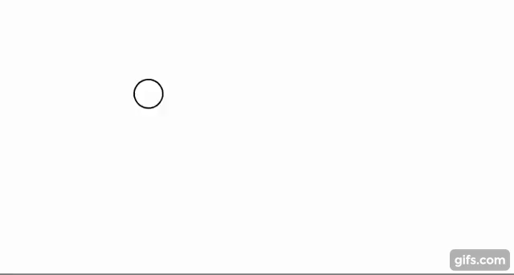

### Homework 3 (due Sunday, September 24, 2017)

Finish your patch from the in-class workshop, and then complete the exercises below on variables and animation and submit them in your [homework repository](http://github.com/zamfi/github-guide).

Label the sketches below `sketch-1.js` etc.; name your file containing your quilt patch `patch.js`.

As a reminder, **please email me if you get stuck!** I am on email more than is probably healthy, and I'm happy to answer questions. Also please make use of the help available to you at CCA: You can get hands-on, in-person help by stopping by the Hybrid Lab and speaking with a lab monitor, or by making an appointment with one of the [Software or Math/Science coaches at the Learning Resources Center](https://www.cca.edu/students/resources/appointments).


#### Programming Practice (due Sunday)

1. Complete your quilt patch from class. Your function should be named something unique ending in `patch`, e.g., `function jdPatch(x, y)`. Follow the [instructions we used in class](https://github.com/zamfi/cca-programming-electronics-fall-2017/blob/master/README.md#workshop) to create your patch. Upload your patch to your `hw3` [github](http://github.com/zamfi/github-guide) in a file called `patch.js`.

2. Modify the [random circles](../class-code/random-circles.js) sketch we worked on in class so that each new circle is drawn at the location of the mouse. Remember that you have `mouseX` and `mouseY` variables defined for you by the rudy playground; these two variables always evaluate to the current `x` and `y` coordinate of the mouse. For example, try this code:

   ```javasript
   var lastMouseX = 0;
   var lastMouseY = 0;
   
   while(true) {
     background(255, 50);
     
     line(lastMouseX, lastMouseY, lastMouseX = mouseX, lastMouseY = mouseY);
   }
   ```
   
   There's variables that get set inside the parameters of a function (what?), but the main idea is this: every time through the loop, draw a line from `lastMouseX, lastMouseY` to `mouseX, mouseY` -- and in the process, update `lastMouseX` and `lastMouseY` to be the value of `mouseX` and `mouseY`. Pause and step through this code to see how the computer evaluates that `line` execution.
   
   For your code, just using `mouseX` and `mouseY` for the `x` and `y` location of the ellipse should suffice -- no variable assignment necessary!

3. Animate a single circle, starting at 100, 100, and moving right 3 pixels each frame. Should look something like this, though note that this gif repeats automatically (and your code doesn't have to). *Note that you will need a variable defined outside your `while (true)` loop in order to track location over time. See today's notes for the [cycling hue](../class-code/cycling-hue.js) example we wrote in class together.*
  
   

4. Modify your single circle code from #3 above so that the circle bounces at the **right** edge of the canvas and reverses direction. *You may need an extra variable to keep track of the direction of the circle's motion, and you'll need an `if` too!*
  
5. Make the circle also bounce on the **left** side of the canvas.

#### Tutorial (due Tuesday)

Watch Daniel Shiffman's video tutorials about [`while` and `for` loops](https://www.youtube.com/watch?v=cnRD9o6odjk) and [nested loops](https://www.youtube.com/watch?v=1c1_TMdf8b8).

Then, answer the following questions in a 'questions.md' file in your repository for this week's homework:

1. What is the difference between a `for` loop and a `while` loop?

1. What are the four parts of a `for` loop? What do they do?

2. What does "nested" mean in the context of nested loops?

